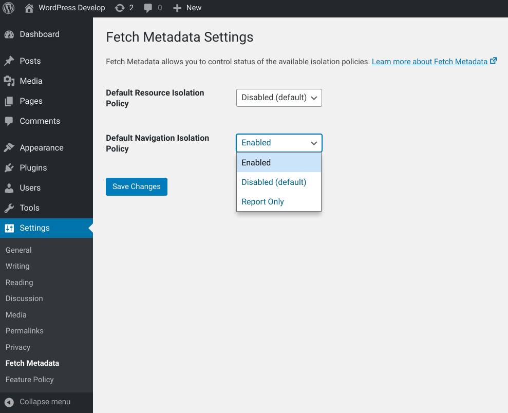

# Fetch Metadata

WordPress plugin that uses [Fetch Metadata Request Headers](https://w3c.github.io/webappsec-fetch-metadata/) to protect your site from clickjacking, reflected XSS, cross-origin attacks like cross-site request forgery (CSRF), cross-site script inclusion (XSSI), timing attacks, cross-origin information leaks or speculative execution side-channel (Spectre) attacks.
The plugin includes a resource isolation policy and a navigation isolation policy by default. 

Read more about Fetch Metadata on [web.dev](https://web.dev/fetch-metadata/).

## Requirements

* WordPress >= 5.0
* PHP >= 5.6

## Contributing

Any kind of contributions to Fetch Metadata are welcome. Please [read the contributing guidelines](https://github.com/enricocarraro/wp-fetch-metadata/blob/master/CONTRIBUTING.md) to get started.

## Further Resources
 * https://w3c.github.io/webappsec-fetch-metadata/
 * https://web.dev/fetch-metadata/
 